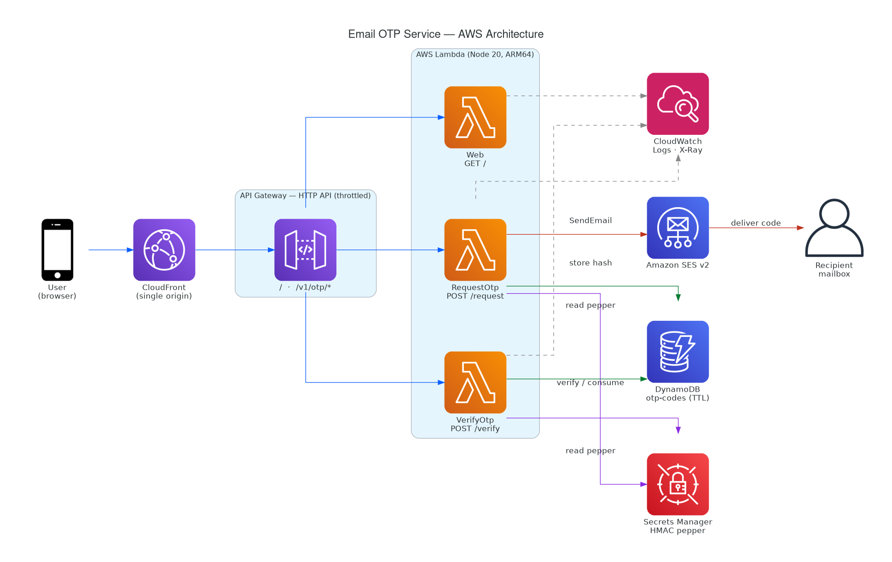
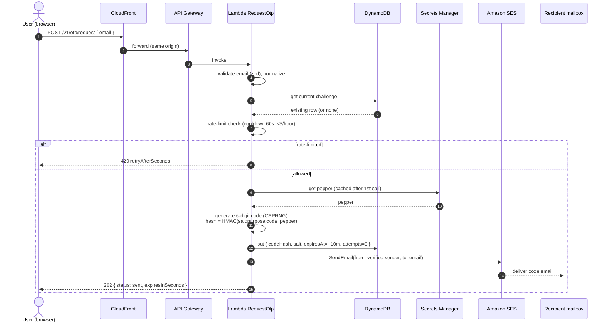
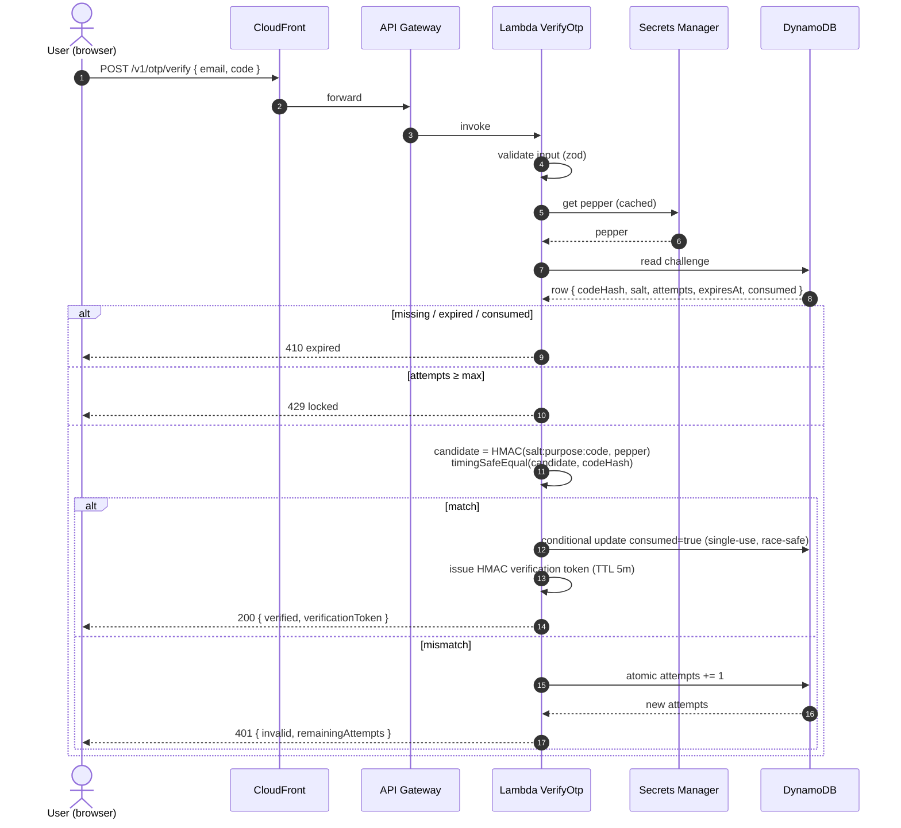

# Solution Architecture — Email OTP Service

A production-grade email one-time-password (verification code) service on AWS. A client requests
a code; the backend generates one, persists **only its salted HMAC**, and emails it via SES; the
user submits the code back; the backend verifies it in constant time and issues a short-lived,
signed verification token.

---

## 1. Technical architecture

> Regenerate with official AWS icons: `python3 docs/architecture_diagram.py`
> (requires `graphviz` and `pip install diagrams`).

| Layer | Service | Responsibility |
| --- | --- | --- |
| Edge | **CloudFront** | Single public origin for both UI and API → same-origin, no CORS; TLS termination; POST passthrough, caching disabled. |
| API | **API Gateway (HTTP API)** | Routing (`GET /`, `POST /v1/otp/{request,verify}`), stage throttling (outer abuse guard), JSON access logs. |
| Compute | **Lambda × 3** (Node 20, ARM64, esbuild) | `Web` serves the UI; `RequestOtp` issues codes; `VerifyOtp` checks them. Stateless, least-privilege. |
| State | **DynamoDB** `otp-codes` | One active challenge per email; TTL auto-expiry; conditional writes enforce single-use & attempt caps. |
| Secret | **Secrets Manager** | HMAC *pepper*, generated by CDK, fetched + cached at runtime. Never in code, logs, or env. |
| Email | **Amazon SES v2** | Sends the code from a verified identity; `ses:FromAddress` IAM condition pins the sender. |
| Observability | **CloudWatch + X-Ray** | Structured JSON logs (Powertools), traces, delivery metrics. |

**Design choices**

- **Same-origin via CloudFront** removes CORS entirely and gives one URL for the whole app.
- **Pepper in Secrets Manager, not env** — a leaked config/env dump never reveals the signing key.
- **One row per email** (PK = normalized email) keeps rate-limit + challenge state atomic and cheap.
- **ARM64 + esbuild bundle** with `@aws-sdk/*` externalized (provided by the runtime) → small, fast cold starts.

---

## 2. Sequence — request a code

## 3. Sequence — verify a code

---

## 4. Security model

| Threat | Control |
| --- | --- |
| DB leak reveals codes | Codes never stored in clear — only `HMAC-SHA256(salt:purpose:code)` keyed by a Secrets-Manager pepper. |
| Signing-key leak via config | Pepper lives in Secrets Manager; fetched at runtime, never an env var or in git. |
| Timing side-channel | `crypto.timingSafeEqual` for hash comparison. |
| Code replay | Single-use: atomic conditional `consumed` flag. |
| Brute force | Max 5 attempts/code, then locked; 6-digit CSPRNG code. |
| Spam / enumeration | Resend cooldown 60s, ≤5 sends/email/hour, API throttling; uniform responses; IP stored only as SHA-256. |
| Cross-flow reuse | `purpose` is bound into the HMAC. |
| Over-broad IAM | `RequestOtp`: table RW + pepper read + `ses:SendEmail` (pinned `FromAddress`). `VerifyOtp`: table RW + pepper read, **no SES**. `Web`: none. |
| Token forgery | Verification token is HMAC-signed with the pepper; tampering or wrong key fails validation. |

---

## 5. Data model — DynamoDB `otp-codes`

| Attribute | Type | Notes |
| --- | --- | --- |
| `id` (PK) | String | Normalized email — one active challenge per address. |
| `codeHash` | String | `HMAC-SHA256(salt:purpose:code)` (hex). |
| `salt` | String | Per-record random salt. |
| `purpose` | String | Bound into the HMAC (e.g. `login`). |
| `expiresAt` | Number | Epoch seconds; **DynamoDB TTL attribute** (auto-delete). |
| `attempts` / `maxAttempts` | Number | Brute-force cap. |
| `sendCount` / `lastSentAt` / `createdAt` | Number | Rolling-window rate limiting. |
| `consumed` | Bool | Single-use guard (conditional writes). |
| `ipHash` | String | SHA-256 of requester IP (no raw IPs). |

`PAY_PER_REQUEST`, AWS-managed encryption, PITR enabled.

---

## 6. Operational notes

- **Deliverability.** SES `Delivery` success ≠ inbox. With an email-address identity, SPF/DKIM
  don't align with the From domain, so mailbox providers (e.g. Gmail) file it as **spam**.
  Production fix: verify a **domain identity** and enable **DKIM** (aligned signing), then send
  `From: no-reply@yourdomain.com`. See README → *Deliverability*.
- **SES sandbox.** Sender *and* recipient must be verified; 200/day, 1 msg/s. Request production
  access to lift this.
- **Deploys are pinned** to `--profile temp-account` (one authorized account); never the local default.
- **Teardown.** `scripts/destroy.sh` — table & secret use `RemovalPolicy.DESTROY` (switch to `RETAIN` for real prod).

---

## 7. Verification (what was tested end-to-end)

| Case | Result |
| --- | --- |
| `GET /` via CloudFront | 200 HTML UI |
| `POST /v1/otp/request` | 202; SES `Delivery` event confirmed |
| Immediate resend | 429 cooldown |
| Wrong code | 401, `remainingAttempts` decrements |
| Correct code | 200 `verified` + signed token |
| Token signature | Re-verified against the pepper → **valid** |
| Reuse consumed code | 410 |

Unit tests (Jest, 28 cases) cover hashing, expiry, rate-limit, validation, token forgery, and
the DynamoDB reserved-keyword guard; CI runs lint + tests + `cdk synth` with no AWS credentials.
